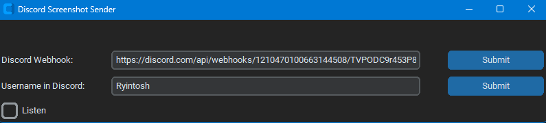

# Upload Screenshots to Discord

This script will allow users to push a singular button (As of now is the Home button) to take a screenshot and upload it to discord. This is done via a discord webhook set up in a discord server.


To install all the dependencies you can run the following command:
```bash
pip install -r requirements.txt
```
With the dependencies set up you can run the script by:
```bash
python ./display.py
```

Below is a display of the application, insert your discord webhook and username. The Listen checkbox on the bottom left is enabling the application to read key inputs (no worries though, we only look for the home button for input)



